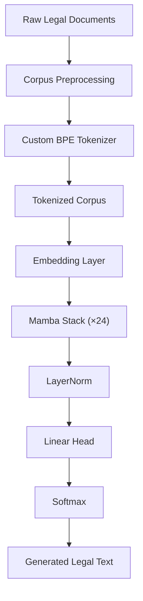
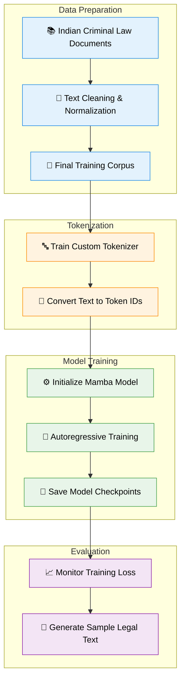
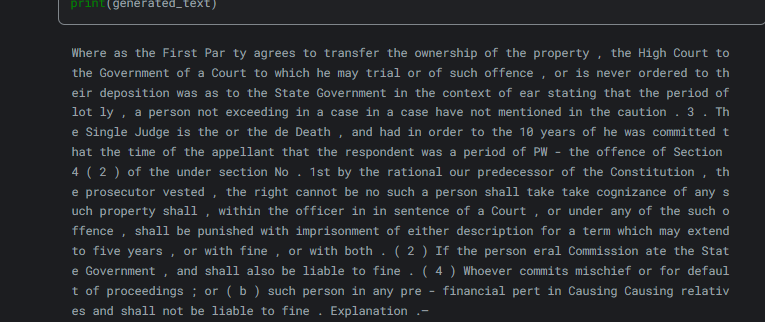
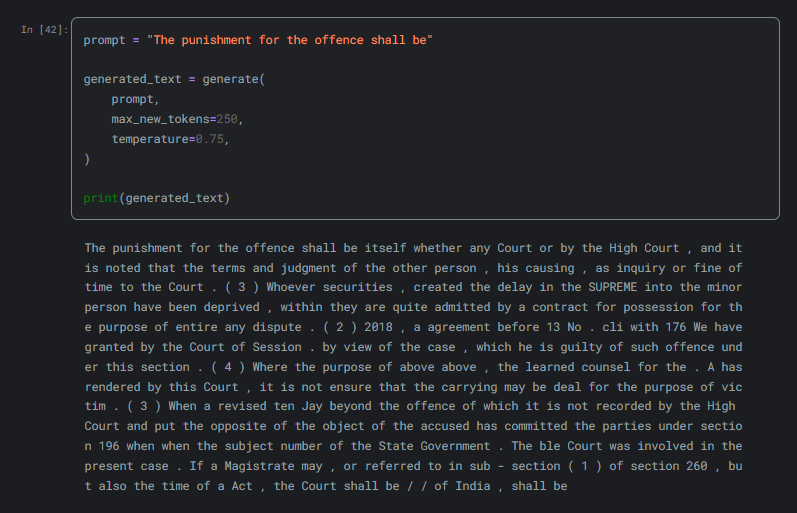

<div align="center">

# ⚖️ Legal-Mamba

### A Domain-Specific Mamba Language Model for Indian Criminal Law

[](https://www.python.org/)
[](https://pytorch.org/)
[](LICENSE)
[](https://www.kaggle.com/code/namanchanana/legal-mamba-training-on-indian-criminal-law)
[]()

*A lightweight autoregressive language model built using the Mamba State Space Model (SSM) architecture and trained on Indian criminal law documents.*

</div>

---

> **Legal-Mamba** explores the application of State Space Models (SSMs) to legal language modeling by training a compact autoregressive model on a curated corpus of Indian criminal law documents. The project covers the complete pipeline—from corpus preparation and tokenizer training to model training and text generation—in a fully reproducible workflow.

---

# Table of Contents

- Overview
- Features
- Why Mamba?
- Project Highlights
- Architecture
- Repository Structure
- Dataset
- Installation
- Usage
- Training
- Inference
- Results
- Limitations
- Future Work
- Acknowledgements
- License

---

# Features

- Custom tokenizer trained specifically for legal text
- Decoder-only language model based on the Mamba State Space Model
- Training pipeline implemented in PyTorch
- Mixed Precision (AMP) support
- Gradient accumulation for memory-efficient training
- Automatic checkpoint saving
- Periodic text generation during training
- Modular and readable implementation
- Fully reproducible Kaggle notebook
- Apache 2.0 licensed

---

#  Project Highlights

| Feature | Description |
|----------|-------------|
| Architecture | Mamba State Space Model |
| Framework | PyTorch |
| Domain | Indian Criminal Law |
| Tokenizer | Custom-trained |
| Training | Autoregressive Next Token Prediction |
| Precision | Mixed Precision (AMP) |
| Checkpointing | Automatic |
| Platform | Kaggle |

---

# Why Mamba?

Traditional Transformer models rely on self-attention, which scales quadratically with sequence length. Mamba replaces attention with **Selective State Space Models (SSMs)**, enabling linear-time sequence processing while maintaining strong modeling capabilities.

For long-form legal documents, this architecture offers an attractive trade-off between computational efficiency and language modeling performance.

This repository is intended as an educational and experimental implementation of a domain-specific Mamba language model rather than a production-ready legal AI system.

---

#  Architecture



The model consists of a stack of Mamba blocks followed by a language modeling head. Training follows the standard autoregressive next-token prediction objective.

---

#  Repository Structure

```text
Legal-Mamba/
│
├── checkpoints/          # Saved model checkpoints
├── data/                 # Training corpus (if included)
├── model.py              # Mamba model implementation
├── train.py              # Training script
├── tokenizer.json        # Trained tokenizer
├── LICENSE
├── README.md
└── requirements.txt
```

The repository is intentionally kept compact, making it easy to understand the complete training workflow without unnecessary abstraction.

---

#  Training Pipeline

##  Project Workflow




This end-to-end workflow enables reproducible experimentation starting from raw legal text and ending with a trained autoregressive language model.


---

# Dataset

The model is trained on a curated corpus of Indian criminal law text. The objective is to learn the language patterns, terminology, and structure commonly found in legal documents.

The corpus was prepared through a preprocessing pipeline that included:

- Collection of legal text from publicly available sources
- Text normalization and cleaning
- Removal of unnecessary formatting and artifacts
- Consolidation into a continuous training corpus
- Tokenization using a custom-trained tokenizer

> **Note**
>
> This repository is intended for research and educational purposes. Users are responsible for ensuring compliance with the licenses and terms of any datasets they use.

---

#  Installation

## Clone the repository

```bash
git clone https://github.com/YOUR_USERNAME/Legal-Mamba.git

cd Legal-Mamba
```

## Create a virtual environment

Linux / macOS

```bash
python -m venv venv

source venv/bin/activate
```

Windows

```powershell
python -m venv venv

venv\Scripts\activate
```

## Install dependencies

```bash
pip install -r requirements.txt
```

---

#  Requirements

Core libraries used in this project include:

- Python 3.10+
- PyTorch
- Tokenizers
- NumPy
- tqdm

Additional packages may be required depending on your training environment.

---

#  Training

The entire training process is handled through `train.py`.

Run:

```bash
python train.py
```

During training, the script performs:

- Dataset loading
- Batch preparation
- Forward pass
- Loss computation
- Mixed Precision training (AMP)
- Gradient accumulation
- Optimizer update
- Learning rate scheduling
- Checkpoint saving
- Sample text generation

Training progress is periodically displayed in the terminal together with the current loss and generated samples.

---

#  Model

The implementation is intentionally compact and organized into modular components.

| File | Purpose |
|------|----------|
| `model.py` | Defines the complete Mamba language model |
| `train.py` | Training loop and optimization |
| `tokenizer.json` | Trained tokenizer vocabulary |

This structure makes the repository easy to read, modify, and extend.

---

#  Tokenizer

The project uses a **custom-trained tokenizer** built specifically for legal language.

Benefits include:

- Better handling of legal terminology
- Reduced token fragmentation
- Improved representation of domain-specific vocabulary
- More efficient utilization of the vocabulary

The tokenizer is stored as:

```text
tokenizer.json
```

---

#  Checkpoints

Model checkpoints are saved periodically throughout training.

Example directory:

```text
checkpoints/

checkpoint_100.pt

checkpoint_200.pt

checkpoint_300.pt
```

These checkpoints allow interrupted training to resume and enable intermediate evaluation.

---

#  Usage

After training, load the trained model and tokenizer before generating text.

Example workflow:

```python
Load tokenizer

Load trained checkpoint

Encode prompt

Run autoregressive generation

Decode output
```

Example prompt

```text
Whereas the First Party agrees to transfer the ownership of the property,
```

Example generated continuation



---

# Training Strategy

The model is trained using standard autoregressive language modeling.

Training incorporates several optimization techniques:

- Mixed Precision (AMP)
- AdamW optimizer
- Gradient accumulation
- Learning rate scheduling
- Automatic checkpointing
- Periodic qualitative evaluation through text generation

These practices improve training efficiency while keeping the implementation relatively simple.

---

# Customization

Several components can be modified depending on experimentation needs:

- Vocabulary size
- Number of layers
- Hidden dimension
- State dimension
- Context length
- Batch size
- Learning rate
- Number of training iterations

The modular implementation allows researchers to experiment with different configurations with minimal code changes.

---


# Results

The primary objective of this project was to build a complete, reproducible pipeline for training a domain-specific Mamba language model rather than achieving state-of-the-art benchmark performance.

The implementation successfully demonstrates:

- End-to-end corpus preprocessing
- Custom tokenizer integration
- Stable autoregressive training
- Periodic checkpoint generation
- Legal text generation during training
- Modular implementation suitable for experimentation

Example generated text:



---

#  Limitations

This project is intended as a research and educational implementation.

Current limitations include:

- Training corpus is relatively small compared to modern large language models.
- Generated text may contain grammatical inconsistencies or repetition.
- The model has not been instruction-tuned.
- No retrieval augmentation (RAG) is used.
- Formal benchmark evaluation has not been performed.

These limitations provide opportunities for future exploration and improvement.

---

# Future Work

Potential future improvements include:

- Expanding the legal corpus with additional publicly available documents.
- Scaling the model to larger parameter counts.
- Experimenting with different tokenizer configurations.
- Incorporating validation metrics such as perplexity.
- Improving inference and sampling strategies.
- Exploring fine-tuning for downstream legal NLP tasks.

---

#  Contributing

Contributions that improve the codebase, documentation, or reproducibility are welcome.

If you would like to contribute:

1. Fork the repository.
2. Create a feature branch.
3. Make your changes.
4. Submit a pull request with a clear description.

Please keep changes focused, well-documented, and consistent with the project's goals.

---

# Acknowledgements

This project builds upon ideas and tools from the open-source machine learning community.

Special thanks to:

- The Mamba research community for advancing State Space Models.
- PyTorch for providing the deep learning framework.
- Hugging Face for tokenizer tooling and ecosystem support.
- Kaggle for providing an accessible GPU training environment.
- John Ma for the educational minimal Mamba implementation that inspired parts of the project structure.

Their contributions to open-source machine learning have made projects like this possible.

---

# References

If you use or extend this work, the following resources provide valuable background.

```bibtex
@article{gu2023mamba,
  title={Mamba: Linear-Time Sequence Modeling with Selective State Spaces},
  author={Gu, Albert and Dao, Tri},
  year={2023}
}
```

Additional references can be found in the official Mamba paper and related State Space Model literature.

---

# 📄 License

This project is licensed under the Apache License 2.0.

See the [LICENSE](LICENSE) file for the full license text.

---

#  Support

If you found this repository useful for learning or experimentation, consider giving it a ⭐ on GitHub.

Feedback, suggestions, and constructive discussions are always appreciated.

---

<div align="center">

### Built with ❤️ using PyTorch and Mamba

**Legal-Mamba — Exploring State Space Models for Indian Criminal Law**

</div>


