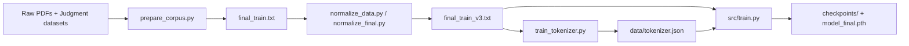

# legal-mamba-indian-criminal-law

Professional project README — in-depth guide, rationale, and reproducibility checklist for training and evaluating a Mamba SSM-based language model on Indian criminal law text.

Overview
--------
This repository provides a compact, reproducible training pipeline for a domain-adapted language model based on the Mamba selective state-space (SSM) architecture. The goal is to train a small-to-medium model targeted at Indian criminal law (statutes and court judgments) for research and proof-of-concept use-cases such as legal drafting assistance, search, and document understanding.

This README is intended for engineers and researchers who want to reproduce the experiments, extend the codebase, or productionize the model responsibly.

Why this repo exists
---------------------
- Minimal, explainable Mamba implementation suitable for research and education.
- End-to-end pipeline: corpus extraction → normalization → tokenizer → model training → checkpoints.
- Focused dataset (Indian criminal law) to explore domain-adaptation for legal language models.

High-level architecture
-----------------------
- Tokenization: custom BPE tokenizer trained on the cleaned legal corpus using `tokenizers`.
- Model: `Mamba` (SSM-based) implemented in `src/mamba.py`, wrapped by `src/model.py` for experiments.
- Training loop: PyTorch-based training with AdamW, gradient clipping, cosine annealing LR schedule, and checkpointing in `src/train.py`.

Mermaid: Data & Training flow



Repository layout (quick)
------------------------
- `src/` — implementation and utilities
	- `mamba.py` — core Mamba block implementation
	- `model.py` — model config + wrapper
	- `train.py` — training loop and hyperparameters
	- `train_tokenizer.py` — BPE tokenizer training
	- `prepare_corpus.py` — PDF extraction + optional Hugging Face judgment fetch
	- `normalize_data.py`, `normalize_final.py` — progressive corpus cleaning
	- `data_factory.py` — optional synthetic instruction generation (requires API key)
- `data/` — input corpus, temporary files, tokenizer output (not committed)
- `checkpoints/` — training checkpoints (ignored)
- `results/` — post-training artifacts and plots (ignored)

Data & dataset notes
--------------------
- Primary sources: cleaned statute PDFs (BNS/BNSS/BSA) and a scraped/chunked set of judgments from Hugging Face (the script references `vihaannnn/Indian-Supreme-Court-Judgements-Chunked`).
- Cleaning stages:
	1. `prepare_corpus.py`: extracts text from PDFs and performs structural cleaning (removes headers, TOC dots, page numbers), then saves `data/final_train.txt`.
	2. `normalize_data.py`: removes Gazette artifacts, encoding noise, and normalizes legal abbreviations.
	3. `normalize_final.py`: final line-level garbage removal and structural cleanup to produce `data/final_train_v3.txt`.

Tokenization
------------
- Trainer: `tokenizers` BPE trainer in `src/train_tokenizer.py` with default `vocab_size=8192` and common special tokens. Adjust `vocab_size` if you expand the corpus.
- Output: `data/tokenizer.json` — used by `src/train.py` via `tokenizers.Tokenizer.from_file()`.

Model & training details
------------------------
Core choices (as implemented):
- Model: Mamba SSM block, tied embedding + LM head, RMSNorm, depth configurable via `ModelArgs`.
- Optimizer: AdamW
- Scheduler: CosineAnnealingLR
- Gradient clipping: L2 norm clipping at 1.0

Default training hyperparameters (edit `src/train.py`):

```text
BATCH_SIZE = 8
BLOCK_SIZE = 256
LR = 3e-4
MAX_STEPS = 300
DEVICE = auto-detect (cuda if available)
```

Recommended (research) settings for more serious experiments
- Increase `MAX_STEPS` to 10k–100k depending on dataset size and compute.
- Use `accelerate` for multi-GPU training; consider mixed precision (AMP) for speed and memory savings.

Reproducibility & exact commands
--------------------------------
1. Create env & install:

```bash
python -m venv .venv
source .venv/bin/activate   # or .venv\Scripts\Activate.ps1 on Windows
pip install -r requirements.txt
```

2. Prepare corpus (place your PDF files in `data/` and update `PDF_FILES` in `src/prepare_corpus.py`):

```bash
python src/prepare_corpus.py
python src/normalize_data.py
python src/normalize_final.py
```

3. Train tokenizer (if needed):

```bash
python src/train_tokenizer.py
```

4. Start training (monitor `checkpoints/`):

```bash
python src/train.py
```

Optional: run under `accelerate` for multi-GPU

```bash
accelerate launch src/train.py
```

Evaluation & validation
-----------------------
- The repo contains a basic loss-tracking mechanism (`loss_history` list). For a rigorous evaluation pipeline you should add:
	- held-out validation split and periodic eval steps
	- perplexity logging
	- downstream tasks: retrieval-augmented QA, summarization fidelity on statutes

Model card / Responsible release checklist
----------------------------------------
Before releasing any trained model, create a `MODEL_CARD.md` covering:
- Intended use and limitations (legal assistance only — not legal advice)
- Training data sources, licenses, and any sensitive content handling
- Evaluation metrics and known failure modes
- Safety mitigations and recommended guardrails
- Licensing and attribution (Apache 2.0 + acknowledgement of upstream work)

Security & secrets
------------------
- Never commit API keys. Use a local `.env` or environment variables. `.gitignore` already excludes `.env` and data artifacts.
- If secrets were committed previously, rotate them and remove from git history (use `git-filter-repo` or the BFG tool).

Credits & acknowledgements
--------------------------
- Minimal Mamba implementation adapted from John Ma's `mamba-minimal` repository: https://github.com/johnma2006/mamba-minimal
- Kaggle notebook and experiments by the project maintainer (see the Kaggle link below).

Reproducible experiments & provenance
------------------------------------
- The original Kaggle runs (notebooks + output logs) are available here:

https://www.kaggle.com/code/namanchanana/legal-mamba-training-on-indian-criminal-law


License
-------
This project is licensed under the Apache License 2.0. See the `LICENSE` file for full terms and attribution.


